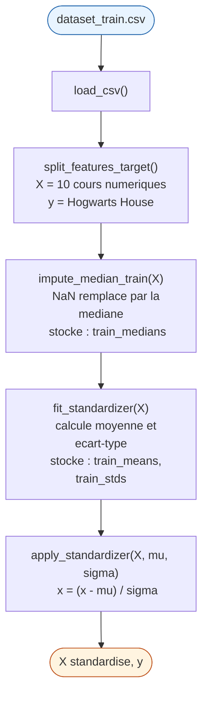
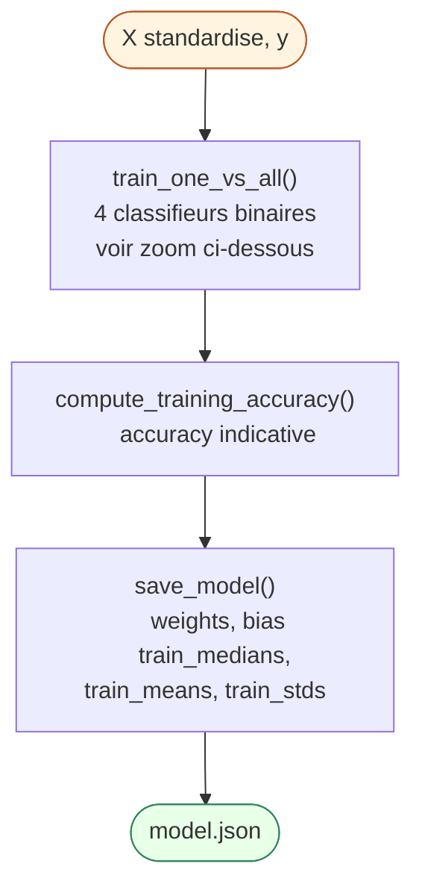
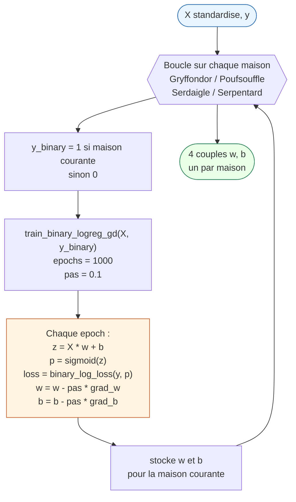

# P3 — Workflow de la Régression Logistique

> Partie obligatoire du sujet (V.3) : construire un **classifieur multi-classes**
> qui attribue à chaque élève l'une des 4 maisons de Poudlard, en utilisant une
> **régression logistique one-vs-all** entraînée par **descente de gradient**.

Le travail est découpé en deux programmes imposés par le sujet :

| Programme           | Rôle                                      | Entrée                            | Sortie        |
|---------------------|-------------------------------------------|-----------------------------------|---------------|
| `logreg_train.py`   | Entraîne le modèle                        | `dataset_train.csv`               | `model.json`  |
| `logreg_predict.py` | Prédit la maison de nouveaux élèves       | `dataset_test.csv` + `model.json` | `houses.csv`  |

---

## Idée centrale : one-vs-all

La régression logistique est un classifieur **binaire** (une classe contre une autre).
Or on a **4 classes** (Gryffondor, Poufsouffle, Serdaigle, Serpentard). On entraîne
donc **4 classifieurs binaires indépendants**, un par maison :

- Classifieur 1 : *"Gryffondor contre toutes les autres"*
- Classifieur 2 : *"Poufsouffle contre toutes les autres"*
- Classifieur 3 : *"Serdaigle contre toutes les autres"*
- Classifieur 4 : *"Serpentard contre toutes les autres"*

Au moment de la prédiction, chaque classifieur renvoie une probabilité. La maison
prédite est celle dont le classifieur donne la **probabilité la plus élevée**
(`argmax`).

---

## 1) Entraînement — `logreg_train.py`

### Entrée
- `datasets/dataset_train.csv` (élèves avec leur vraie maison)

### Vue d'ensemble — Preprocessing



### Vue d'ensemble — Entraînement



### Zoom sur `train_one_vs_all()`



### Étape par étape

**1. Charger le CSV**
Lire les données d'entraînement dans un DataFrame.

**2. Séparer features et target**
- Target `y` = colonne `Hogwarts House`
- Features `X` = uniquement les colonnes numériques (cours).
  Les colonnes catégorielles (prénom, nom, date de naissance…) sont retirées :
  elles n'apportent pas de signal de classification.

**3. Gérer les valeurs manquantes (imputation)**
Certaines notes sont manquantes. Pour chaque feature, on remplace `NaN` par la
**médiane** de la colonne, calculée sur le jeu d'entraînement.
→ Pourquoi la médiane ? Elle est robuste aux valeurs aberrantes, contrairement à la moyenne.
→ On **stocke** ces médianes : il faudra les réutiliser en prédiction.

**4. Standardiser les features (z-score)**
Pour chaque feature, on calcule la **moyenne `μ`** et l'**écart-type `σ`** sur
le jeu d'entraînement, puis on transforme chaque valeur :

```
x' = (x - μ) / σ
```

→ Pourquoi ? Les cours ont des échelles très différentes (ex. Astronomie ≈ 1000,
Arithmancie ≈ -300000). Sans standardisation, la descente de gradient avance
beaucoup trop lentement sur les petites échelles et explose sur les grandes.
→ On **stocke** ces `μ` et `σ` : il faudra les réutiliser en prédiction.

**5. Entraîner les 4 classifieurs binaires (boucle one-vs-all)**
Pour chaque maison dans `[Gryffondor, Poufsouffle, Serdaigle, Serpentard]` :

- Construire une target binaire : `y_binary = 1` si l'élève est dans cette maison, sinon `0`
- Initialiser les poids `w` (à zéro) et le biais `b` (à zéro)
- Lancer la **descente de gradient** sur un nombre d'epochs fixé. À chaque epoch :

  ```
  z = X · w + b                    # score linéaire
  p = sigmoid(z) = 1 / (1 + e^-z)  # probabilité d'appartenir à cette maison
  loss = log-loss(p, y_binary)     # quantité d'erreur
  gradients = ∂loss/∂w , ∂loss/∂b
  w = w - learning_rate * ∂loss/∂w
  b = b - learning_rate * ∂loss/∂b
  ```

- Sauvegarder `(w, b)` pour cette maison.

**6. Calculer la précision d'entraînement** (indicatif — permet de vérifier que l'apprentissage a bien eu lieu).

**7. Tout sauvegarder dans `model.json`**
Le fichier contient :
- les `features` utilisées (l'ordre des colonnes compte)
- les `houses` (ordre des classes)
- les `weights` et `bias` pour chaque maison
- les paramètres de preprocessing : `train_medians`, `train_means`, `train_stds`

### Sortie
- `model.json`

---

## 2) Prédiction — `logreg_predict.py`

### Entrées
- `datasets/dataset_test.csv` (élèves **sans** leur maison)
- `model.json`

### Étape par étape

**1. Charger le CSV de test et le modèle.**

**2. Réappliquer EXACTEMENT le même preprocessing qu'à l'entraînement**
- Sélectionner les mêmes colonnes (ordre identique)
- Imputer les valeurs manquantes avec `train_medians` (depuis `model.json`)
- Standardiser avec `train_means` et `train_stds` (depuis `model.json`)

→ Point critique : on **ne doit pas** recalculer médianes / moyennes / écarts-types
sur le jeu de test. Le poids `w` a été ajusté pour une échelle précise (celle du
train). Si tu changes l'échelle à la prédiction, le score `z = X · w + b` est
faussé et la prédiction est mauvaise.

**3. Calculer une probabilité par maison**
Pour chaque classifieur (maison) :

```
p_maison = sigmoid(X · w_maison + b_maison)
```

**4. Choisir la maison gagnante (`argmax`)**
Pour chaque élève, on prédit la maison dont la probabilité est la plus élevée.

**5. Écrire `houses.csv`** au format exact imposé par le sujet :

```
Index,Hogwarts House
0,Gryffindor
1,Hufflepuff
...
```

### Sortie
- `houses.csv`

---


## Résumé express

> « Je dois classer des élèves dans 4 maisons, mais la régression logistique
> ne fait que du binaire. Donc j'entraîne 4 classifieurs binaires (un par maison,
> chacun disant *cette maison contre toutes les autres*). Je prétraite les données —
> imputation par la médiane et standardisation z-score — et j'apprends les poids
> par descente de gradient sur la log-loss. Au moment de prédire, je réapplique
> le même preprocessing, je calcule les 4 probabilités pour chaque élève, et je
> retiens la maison dont la probabilité est la plus élevée. »
